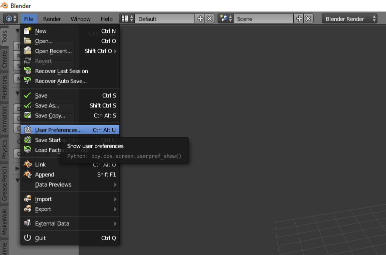
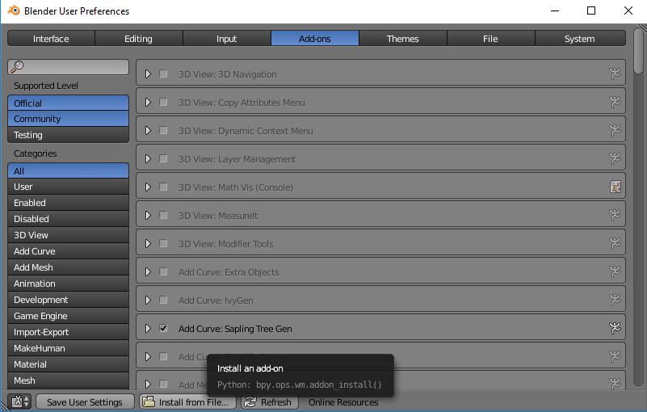
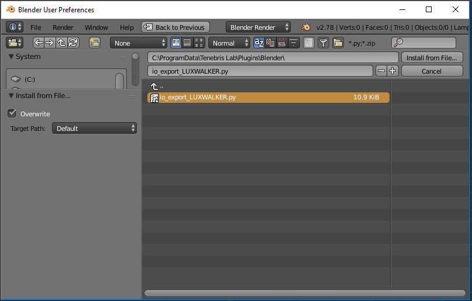
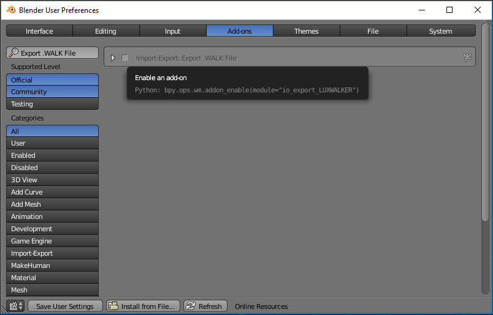
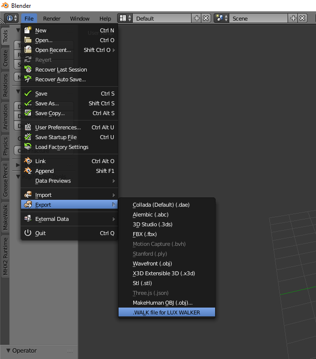

Blender .WALK Plugin
======================================

Instantly convert files from Blender to VR. Explore a fully immersive true-to-life scale model in LUX Walker.

Please install the Export Plugin in order to export to .WALK files from Blender.

Step 1: Go to File>User Preferences in Blender.

Step 2: Select Add-ons and click on Install from File….

Step 3: Navigate to C:\ProgramData\Tenebris Lab\Plugins\Blender\ and select the io_export_LUXWALKER.py file.

Step 4: Enable the .WALK Add-on

You are now ready to export to LUX Walker.

Project Information - Blender
^^^^^^^^^^^^^^^^^^^^^^^^^^^^^^^

Unfortunately we are not yet able to extract gps information from your blender file.

Model Preparation - Blender
^^^^^^^^^^^^^^^^^^^^^^^^^^^^^^^

Please make sure your model is as clean as possible to ensure best performance.

Exporting a .WALK File
^^^^^^^^^^^^^^^^^^^^^^^^^^^^^^

The Exporter will export everything that is visible in the view. Please hide objects and layers that does not require exporting.

1. Export from the File>Export Menu.

2. Find the .WALK file in the same folder as your Blend file.
3. Open the .WALK file in LUX Walker by double clicking or selecting in LUX Walker.

Enjoy your WALK

.

FAQ - Blender
^^^^^^^^^^^^^^^^^^^^^^^^^^^^^^^

1. XXX:

  xxx

2. XXX:

  xxx
