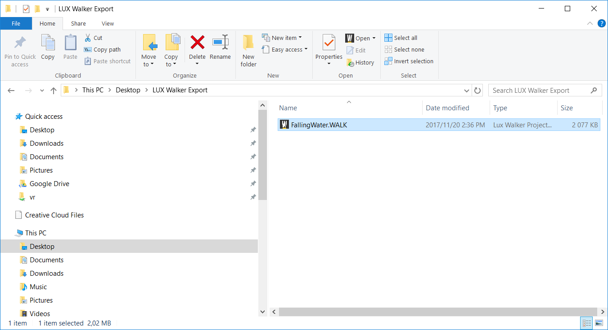
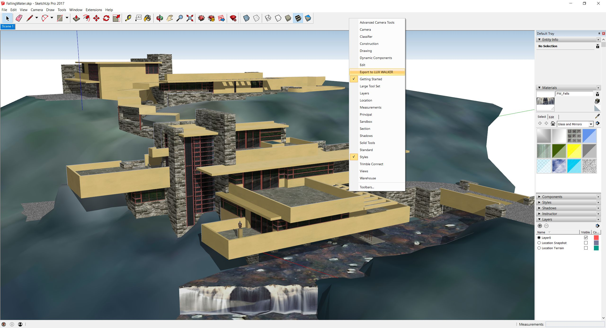
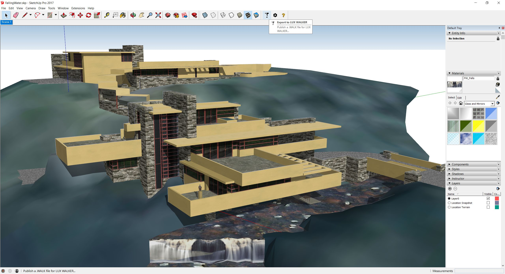
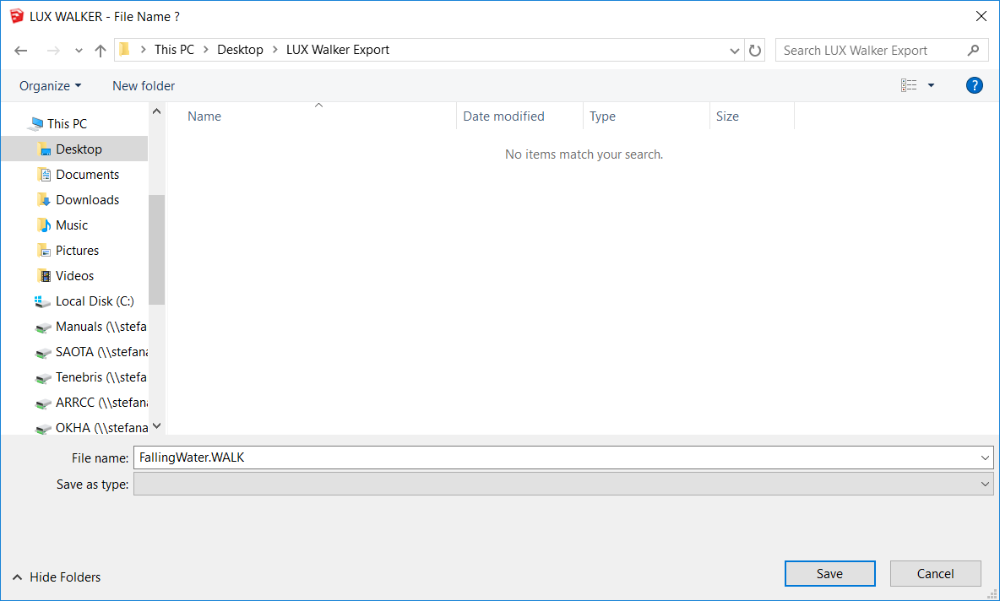

Sketchup .WALK Plugin
======================================

Our Sketchup plugin is compatible with Sketchup 2015-2019.
You can export from any other version using the OBJ Export Method

Project Information - SKP
^^^^^^^^^^^^^^^^^^^^^^^^^^^^^^^

Your project coordinates will be exported to LUX Walker as well as any views you have set up.

.. image:: sketchup/images/geolocate.jpg

Go to Window > Model Info > Geo-location and click Add Location

Ensure your project is orientated correctly in Sketchup if you want the correct context and shadows.

Model Preparation - SKP
^^^^^^^^^^^^^^^^^^^^^^^^^^^^^^^

Please make sure your model is as clean as possible to ensure best performance.

.. image:: sketchup/images/enabletoolbar.jpg

You can right click on the toolbar area to enable the LUX Walker toolset.

Correct layer management in Sketchup will ensure less issues down the road.

.. image:: sketchup/images/toolbar.jpg

Included in the toolset is a simple button to setup your project with correct layers.

You can then Right click on a group or component and Click LUX WALKER - Put On Layer > LAYER

.. image:: sketchup/images/layers.jpg

This will put all object and geometry nested in the group or component onto the selected LAYER.

LUX Walker includes a library of items and entourage.

.. image:: ./revit/images/WireFrame.png

Please disable items, groups, components and layers you do not need to see in VR.
It is sometimes best to purge your file before export.  - Make a backup before purging.

 We recommend running `Cleanup 3 for Sketchup <https://extensions.sketchup.com/en/content/cleanup%C2%B3>`_. to clean unnecessary items. It has built in purge functionality.

Exporting a .WALK File
^^^^^^^^^^^^^^^^^^^^^^^^^^^^^^

The Exporter will export everything that is visible in the view. Please hide objects and layers that does not require exporting.

1. Open a Sketchup project that you wish to export for VR Walkthrough.

2. Enable the Tenebris Lab Plugins to export to LUX Walker.

SketchUp to VR

3. Save your file and Click the Export Lux button on the Tenebris Lab section.

SketchUp to VR

4. Choose a folder you wish to export your .WALK file into.

SketchUp to VR folder

5. Open the .WALK file in LUX Walker by double clicking or selecting in LUX Walker.

SketchUp to VR file

Enjoy your WALK

.

FAQ - SKP
^^^^^^^^^^^^^^^^^^^^^^^^^^^^^^^

1. It is taking forever to export my file:

  Sketchup does not like complex geometry. Please cleanup your model and removed unused items. We recommend running `Cleanup 3 for Sketchup <https://extensions.sketchup.com/en/content/cleanup%C2%B3>`_. to clean unnecessary items

2. XXX:

  xxx
