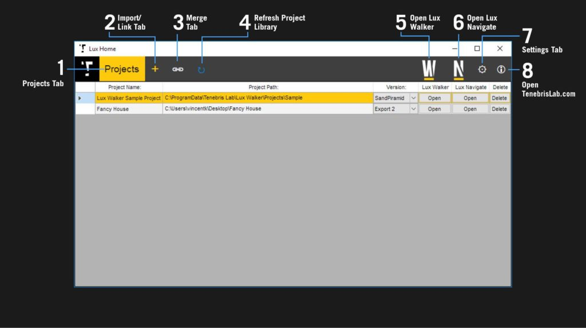
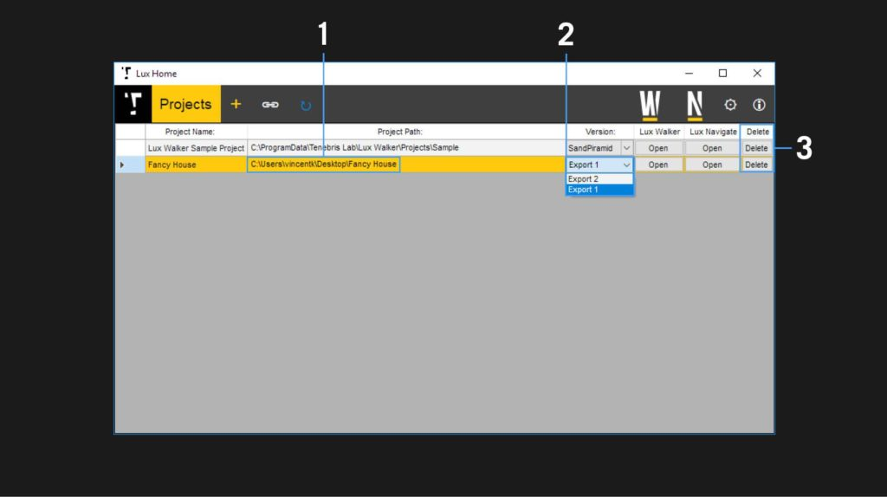
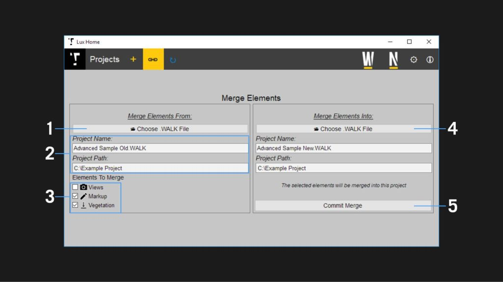
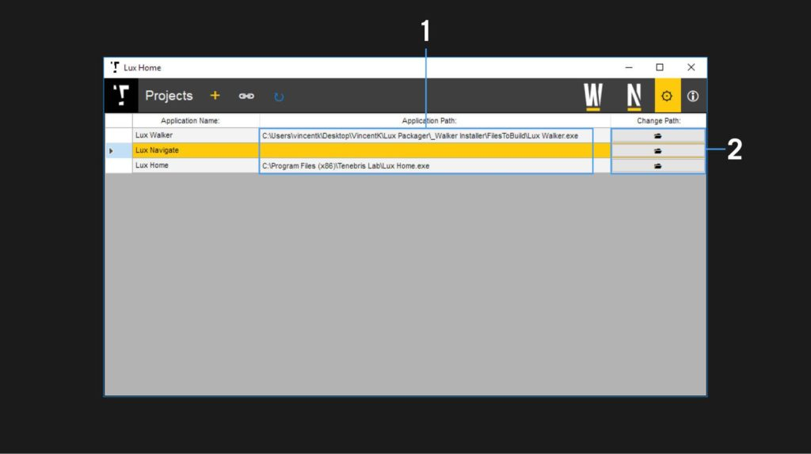

LUX Home
======================================

Manage projects with a view of your recent files  in LUX Home.

Overview
^^^^^^^^^^^^^^^^^^^^^^^^^^^^^^^^^^^^

1. Projects Tab
2. Import/Link Tab
3. Merge Tab
4. Refresh Project Library
5. Open Lux Walker
6. Open Lux Navigate
7. Settings Tab
8. Open TenebrisLab.com

Projects Tab
^^^^^^^^^^^^^^^^^^^^^^^^^^^^^^^^^^^^

View all your exported projects, select a project and open it in Lux Walker or open renders in Lux Navigate.

1. Project Paths – Shows where the project files are located. Click to open folder in File Browser
2. Version Selector – Choose which exported version of the project you would like to open
3. Remove Project from Library. No files will be deleted.

Link Tab
^^^^^^^^^^^^^^^^^^^^^^^^^^^^^^^^^^^^

.. image:: images/lh_2.jpg

Allows dragging and dropping a folder to convert it to a .WALK file. The folder needs .obj and .mtl files inside, as well as a folder containing your textures.

You can also drag in a .WALK file to add it to your library. This allows you to add projects located on a network drive, that may have been exported by someone else.

Merge Tab
^^^^^^^^^^^^^^^^^^^^^^^^^^^^^^^^^^^^

Allows you to merge files between two .WALK files. If you have cameras, markup or vegetation in a project and you would like to add it to an updated export of the project you can use this tab to merge items between projects.

1. Browse for the project file that contains the items you would like to add to another project.
2. The project name and location will autofill once a project file is selected.
3. Check which items you would like to be merged.
4. Select the target project to which you wish to add the selected items.
5. Click to commit merge and copy items to project.

Settings  Tab
^^^^^^^^^^^^^^^^^^^^^^^^^^^^^^^^^^^^

Manages the linking between the various Lux Suite programs and Lux Home. Used to re-establish the links if they were lost.

1. The current path to the selected program.
2. Click to change the location of the selected program.
