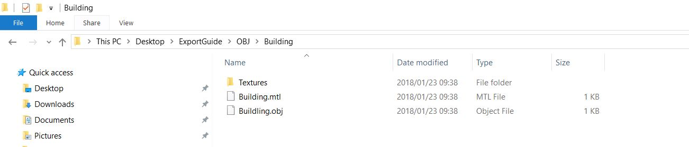
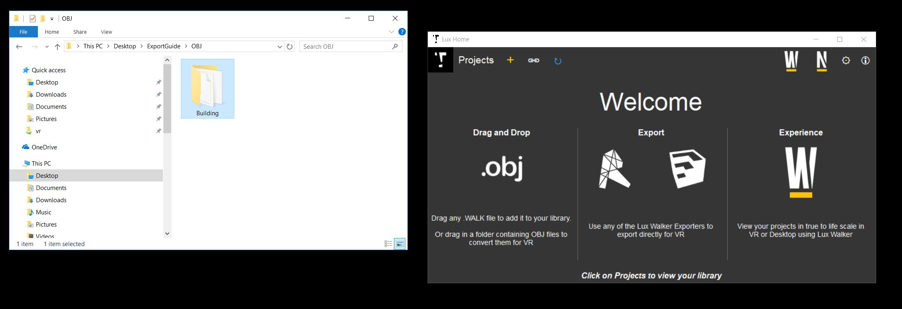
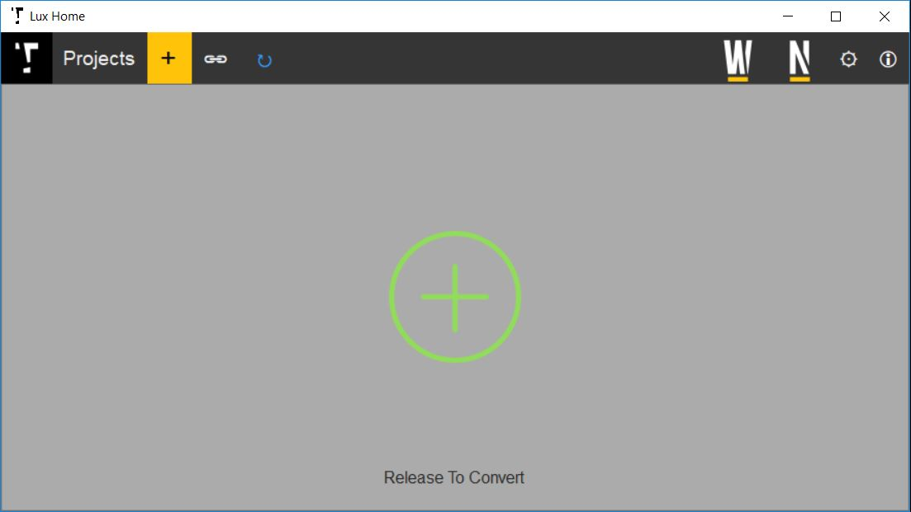
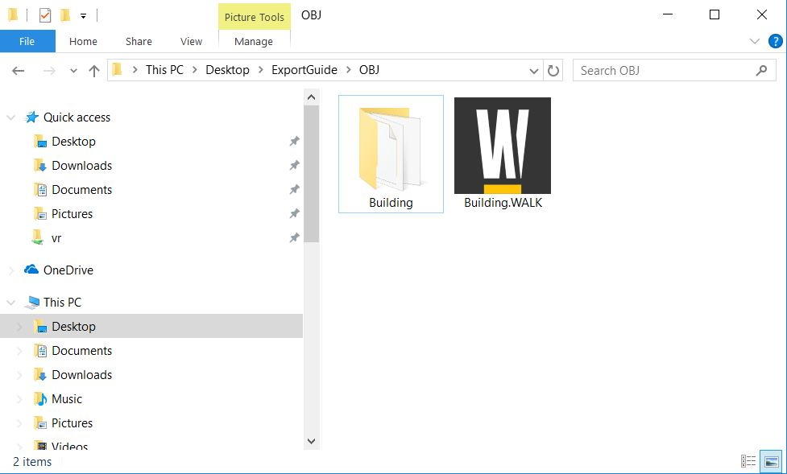

OBJ Export
======================================

LUX Walker is compatible with .OBJ files exported from your favorite 3D modeling software.
We have imported files successfully from:
Archicad
Cinema4d
3Ds Max
Blender
Sketchup

Project Information - OBJ
^^^^^^^^^^^^^^^^^^^^^^^^^^^^^^^

Unfortunately we are not yet able to automatically insert gps information into your file.
Please import your model into Sketchup or Revit and export from there to have accurate gps locations.

.. note::
 :ref:`Need Help?`

 Contact us if you know how to edit an ini file...

Model Preparation - OBJ
^^^^^^^^^^^^^^^^^^^^^^^^^^^^^^^

Please make sure your model is as clean as possible with the least amount of geometry you can show to ensure best performance.

.. note::
 You may be able to load much larger files if you split your model into more exported files - by category perhaps.
 Smooth and round objects will cause issues. If possible reduce triangle count as much as possible.

Creating a .WALK File
^^^^^^^^^^^^^^^^^^^^^^^^^^^^^^

Step 1: Create a folder and export your .OBJ to this folder. Make sure all textures are in a folder.

.. note::
 You can have multiple .OBJ and .MTL files from different modelling programs as long as they all share the same origin and scale.

Step 2: Open “LUX Home” click on the + icon

Step 3: Drag the folder containing the .OBJ to LUX Home.

Step 4: A .WALK file will be generated next to your export folder.

3. Open the .WALK file in LUX Walker by double clicking or selecting in LUX Walker.

Enjoy your WALK

|
