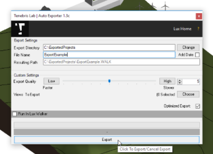

Revit  .WALK Addin
======================================

Our Revit plugin is compatible with Revit 2018-2020 and makes exporting your projects simple yet highly customizable.

Project Information
^^^^^^^^^^^^^^^^^^^^^^^^^^^^^^^

.. note::
 Your project location and project North will be imported along with any selected cameras.

Model Preparation
^^^^^^^^^^^^^^^^^^^^^^^^^^^^^^^

.. note::
 Please make sure your model is as clean as possible to ensure best performance.

.. toctree::
   :maxdepth: 2
   :caption: Exporting from Revit

   revit/index

Export Process
^^^^^^^^^^^^^^^^^^^^^^^^^^^^^^^
.. note::
 The Exporter will export anything that is visible in the view. Please disable anything that does not require discussion.

.. toctree::
   :maxdepth: 1

   revit/export

FAQ - Revit
^^^^^^^^^^^^^^^^^^^^^^^^^^^^^^^

.. note::
 LUX Walker is slow:

 :ref:`Reduce geometry quality using the quality slider<Export Window Settings>`.
 and Remove unused details and objects from the export view.

.. note::
 Material Transfer:

 :ref:`Materials are not correct in LUX Walker<Material Transfer>`.
 Ensure the material settings are correct in Revit. Materials with fade and tint will export these settings to LUX Walker.
