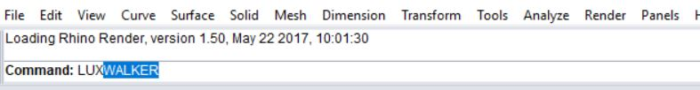
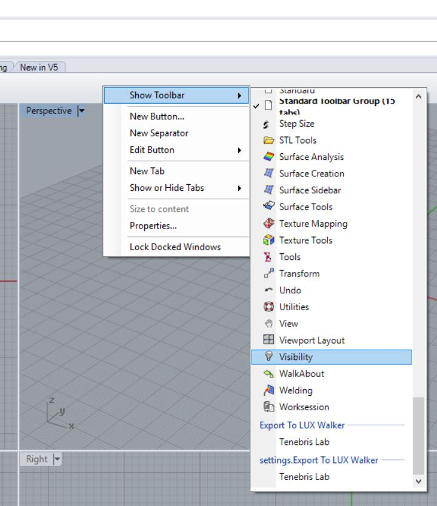

Rhino .WALK Plugin
======================================

Rhino to VR. Instantly convert your Rhino model in to a fully immersive true-to-life scale design model, with LUX Walker.

.. note::
 First you need to install the plugin for Rhino.

 1.  `Download the Latest Rhino plugin from here  <https://tenebrislab.com/wp-content/uploads/LWPlugins/Rhino/Export%20To%20LUX%20Walker.rhi>`_.
 2. Double click the downloaded file (Export To LUX Walker.rhi) to install the Plugin to export to LUX Walker.

 You might have to reload Rhino if it was open during installation of the plugin.

Project Information - Rhino
^^^^^^^^^^^^^^^^^^^^^^^^^^^^^^^

Setting up the Sun correctly in Rhino ensures correct location info is transferred to LUX Walker.

.. note::
 Go to the pulldown menu Panels and open the Sun panel

 .. image:: rhino/images/0_Sun.jpg

 This will give you access to the correct simulation of the sun position

 .. image:: rhino/images/1_Sun.jpg

 In the sun menu:

 1. The sun option has to be activated
 2. The North direction has to be set to your offset, if any, in degrees. This will orient the north correctly with your scene

 .. image:: rhino/images/2_Sun.jpg

 3. The last setting is the location. The nearest location can be selected from the list or by clicking Here the location is set based on the location of the laptop. With these settings the sun will be positioned correctly in LUX Walker.

Model Preparation - Rhino
^^^^^^^^^^^^^^^^^^^^^^^^^^^^^^^

Please make sure your model is as clean as possible to ensure best performance.

Exporting a .WALK File
^^^^^^^^^^^^^^^^^^^^^^^^^^^^^^

.. note::
 The Exporter will export everything that is visible in the view. Please hide objects and layers that does not require exporting.

1. Run the command LUXWALKER in Rhino.

Optionally enable the Tenebris Lab toolbar.

2. Find the .WALK file in the same folder as your Rhino file.
3. Open the .WALK file in LUX Walker by double clicking or selecting in LUX Walker.

Enjoy your WALK

.

FAQ - Rhino
^^^^^^^^^^^^^^^^^^^^^^^^^^^^^^^

1. XXX:

  xxx

2. XXX:

  xxx
