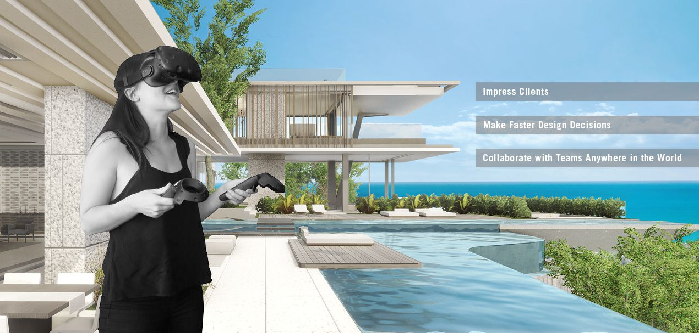

Documentation for
======================================

.. raw:: html

    

        <iframe src="https://www.youtube.com/embed/BDFOwY4lOOM?rel=0" frameborder="0" allowfullscreen style="position: absolute; top: 0; left: 0; width: 100%; height: 100%;"></iframe>
    

|

Guide Information::

    This guide aims to get you up and running using LUX Walker.

About:

  Experience Architecture in Virtual Reality.
  `LUX WALKER <https://www.luxwalker.com/>`_ is an interactive PC and VR application that instantly converts your 3D model into a fully immersive 3D true-to-life scale model.
  Compatible with most 3D modelling software, one-click opens your 3D model as a .WALK file in LUX Walker.

  `LUX WALKER <https://www.luxwalker.com/>`_ has been developed as a real-time visualization tool to improve workflow and reduce communication errors.
  Join multiple people in a virtual building, collaborate with your team members throughout design development and present your final design to clients, from anywhere in the world.

.. toctree::
   :maxdepth: 2
   :caption: LUX Walker:

   extra/about

System Requirements and Installation
======================================

More Info:

    See below for more system requirements and Installation instructions.

.. toctree::
   :maxdepth: 3
   :caption: Getting Started:

   extra/index

Exporting
======================================

More Info:

    See below for more information exporting from your favorite 3D tool.

.. toctree::
   :maxdepth: 2
   :caption: Exporting Projects:

   export/index

Using LUX Walker
======================================
More Info:

    See below for more information on using LUX Walker.

.. toctree::
  :maxdepth: 3
  :caption: Using LUX Walker:

  using/index

.. toctree::
  :maxdepth: 3
  :caption: Advanced Features:

  advanced/settings
  advanced/lhome

Contact and Support
======================================

..
  * :ref:`genindex`
  * :ref:`modindex`
  * :ref:`search`

.. toctree::
   :maxdepth: 3
   :caption: Support:

   extra/help
   extra/license
